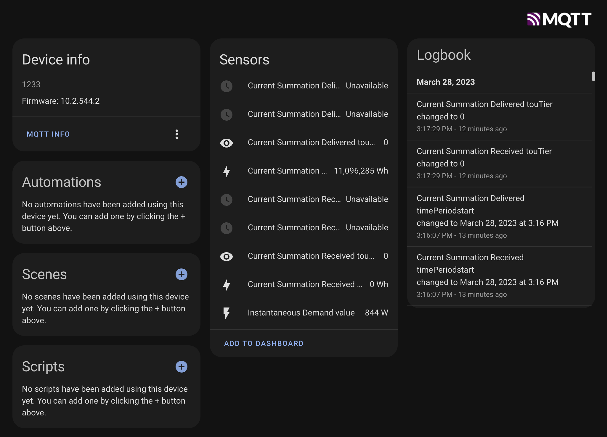

# Connect Your Smart Meter to MQTT!

Recently Xcel energy rolled out smart meter installations to facilitate TOU(Time of Use) pricing. This also benefits us, the users, as it provides us with a free way to see how much energy we're using at any time. This repo will help you get up and running with a python program that will query your meter on your network and convert its readings to MQTT messages.



## Setup

Enroll in Xcel enery launchpad, [here](https://my.xcelenergy.com/MyAccount/s/meters-and-devices/), and get your meter joined to your network.\
Generate an SSL key to use to provide a handshake to your meter. Add this to your Xcel launchpad by clicking "Add a Device" and paste in in the LFDI generated by the script below. Nickname, Manufacturer of Device, and Device Type can be whatever you want.
```
./scripts/generate_keys.sh
```
This script will generate new keys and print out the LFDI string to use for registering with Xcel. If you're already generated keys and you need to retrieve the LFDI string again run:
```
./scripts/generate_keys.sh -p
```
These keys will be saved in the local directory `certs/.cert.pem` and `certs/.key.pem`

## Docker
Pull from remote (easy)
```
docker pull ghcr.io/zaknye/xcel_itron2mqtt:latest
```
or (harder)\
Build the container locally.
```
./scripts/docker-build.sh
```
Then run the container using the required options below.
### Options
The following are options that may be passed into the container in the form of environment variables or required volumes.
| Option | Expected Arg | Optional |
| ------ | ------------ | -------- |
| -v <path_to_cert_folder>:/opt/xcel_itron2mqtt/certs | Folder path to the certs generated with the generate keys script | NO |
| -e MQTT_SERVER | IP address of the MQTT server to communicate with | NO |
| -e MQTT_PORT | Port # of the MQTT server to communicate with, **Default: 1883**| yes |
| -e MQTT_TOPIC_PREFIX | Prefix of MQTT topic set in Home Assistant, **Default: homeassistant/** | yes |
| -e METER_IP | IP address of the itron meter. Useful for those that run iot devices on other vlans | yes |
| -e METER_PORT | Port number of the meter, must be set if `METER_IP` is set. **Default: 8081**| yes |
| -e MQTT_USER | Username to authenticate to the MQTT server | yes |
| -e MQTT_PASSWORD | Password to authenticate to the MQTT server | yes |
| -e CERT_PATH | Path to cert file (within the container) if different than the default | yes |
| -e KEY_PATH | Path to key file (within the container) if different than the default | yes |
| -e LOGLEVEL | Set the log level for logging output (default is INFO) | yes |
## Compose (best way)
Docker compose is the easiest way to integrate this repo in with your other services. Below is an example of how to use compose to integrate with a mosquitto MQTT broker container.
### Example
```
mosquitto:
  image: eclipse-mosquitto
  ...
xcel_itron2mqtt:
    image: ghcr.io/zaknye/xcel_itron2mqtt:main
    restart: unless-stopped
    volumes:
      - ~/xcel_itron2mqtt/certs:/opt/xcel_itron2mqtt/certs
    network_mode: host
    links:
      - mosquitto
    environment:
      - MQTT_SERVER=mosquitto
```

See the `docker-compose.yaml` file for a working example
## CLI
### Example
```
docker run --rm -d \
    --net host \
    -e MQTT_SERVER=<IP_ADDRESS> \
    -v <path_to_cert_folder>:/opt/xcel_itron2mqtt/certs \
    ghcr.io/zaknye/xcel_itron2mqtt:main
```
> The easiest way currently to pass through mDNS to the container is to use host networking.
>
> Maybe in the future use https://github.com/flungo-docker/avahi
### Development Example
For running as a developer, the following is helpful to allow you to work in the container
```
docker run --rm -it \
    --net host \
    -v `pwd`:/opt/xcel_itron2mqtt \
    --entrypoint /bin/sh \
    ghcr.io/zaknye/xcel_itron2mqtt:main
```

Alternatively, the `docker-compose.yaml` will allow you to bring a up an ephemeral MQTT broker along with the xcel_itron2mqtt container. Simply copy `.env.sample` to `.env`, update variables there as needed, and run `docker compose up`. You can then use `docker exec -it xcel_itron2mqtt /bin/bash` to attach to the running container.

### Using Nix
If you have Nix with flakes enabled, you can use the provided flake to set up a development environment with Python 3 and all required dependencies:
```
nix develop
```

This will drop you into a shell with Python and all packages from `requirements.txt` available.

For local development, create a `hack/run.sh` script with your settings (this directory is gitignored):

```sh
#!/bin/sh
cd "$(dirname "$0")/../xcel_itron2mqtt" || exit 1

export MQTT_SERVER=localhost
export MQTT_PORT=1883
export MQTT_USER=your_user
export MQTT_PASSWORD=your_password
export LOGLEVEL=DEBUG
python3 -Wignore main.py
```

Make it executable with `chmod +x hack/run.sh`, then run with `./hack/run.sh`.

## Troubleshooting

### Verifying MQTT User Permissions

If messages aren't appearing in your MQTT broker, verify that your MQTT user has the correct read/write permissions.

**1. Test MQTT publish/subscribe functionality:**

In one terminal, start a subscriber:
```bash
mosquitto_sub -h localhost -t "test/topic" -u your_mqtt_user -P your_password
```

In another terminal, publish a test message:
```bash
mosquitto_pub -h localhost -t "test/topic" -m "test message" -u your_mqtt_user -P your_password
```

If the subscriber receives the message, your MQTT user has proper permissions.

**2. Check ACL configuration:**

If messages aren't being received, check your Mosquitto ACL file (typically `/etc/mosquitto/acl.conf` or similar). Your user needs read/write access to the topics:

```
user your_mqtt_user
topic readwrite #
```

The `#` wildcard grants access to all topics. For more restrictive access, specify the topic prefix:
```
user your_mqtt_user
topic readwrite homeassistant/#
```

**3. Reload Mosquitto after configuration changes:**

After modifying ACL or password files, restart Mosquitto to apply changes:
```bash
sudo systemctl restart mosquitto
```

Or reload the configuration without full restart:
```bash
sudo systemctl reload mosquitto
```

**4. Enable debug logging:**

Set `LOGLEVEL=DEBUG` in your environment to see detailed MQTT publish attempts and responses.

## Contributing

Please feel free to create an issue with a feature request, bug, or any other comments you have on the software found here.

To contribute code, create a new fork, then create a pull request once your new feature/fix is complete.

# Contact
Zak Nye - [zaknye.com](https://zaknye.com) - zaknye@gmail.com
